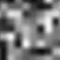

# Toon Fire Shaders

These are the shaders:

<table>
  <tbody>
    <tr>
      <th>Fire A</th>
      <th>Fire B</th>
      <th>Fire C</th>
      <th>Fire D</th>
      <th>Fire E</th>
      <th>Fire F</th>
    </tr>
    <tr>
      <td></td>
      <td></td>
      <td></td>
      <td></td>
      <td></td>
      <td></td>
    </tr>
  </tbody>
</table>

## How to use

You can find the finished shaders at [/Toon-Fire-Shaders-OpenGL/resources/shaders/](Toon-Fire-Shaders-OpenGL/resources/shaders/):
- "plain_quad.vertex"
- "fire_A.fragment"
- "fire_B.fragment"
- "fire_C.fragment"
- "fire_D.fragment"
- "fire_E.fragment"
- "fire_F.fragment"

The shaders assume to be painting a quad with texture coordinates such that (0, 0) is at the bottom left corner, and (1, 1) is at the top right corner.

The C++ project only works with x64 architecture, and requires the following libraries:
- GLAD
- GLFW
- GLM
- OpenGL

## The shaders

These shaders work by generating and combining several noise textures and gradients, and flat-painting the result, depending on its brightness, with 2-3 predefined colors. The flames' upward movement is obtained by offsetting the procedural noise textures over time.

The fire is a simple square consisting of 2 triangles. The vertex shader calculates its screen position, and transmits it (along with its texture coordinates) to the fragment shader. The fire effect happens in the fragment shader.

This is what happens in the fragment shader, step by step:

### Step 1: Perlin noise

We generate a Perlin noise texture* using:
- The texture coordinates (scaled up to achieve softer color changes) as the tiling.
- Time (scaled, affecting the Y axis much more than the X axis, to achieve the upward and slightly sideways movement) as the offset.

\*We don't actually generate any texture image. We simply obtain the value of the perlin noise function for that fragment. The "texture" is what appears if you paint them in grayscale on screen.

### Step 2: Perlin noise (slightly different)

We generate another Perlin noise texture, but with a slightly different offset than the previous one.

### Step 3: Noise average

We obtain the average value of the previous two steps. At this point, we can almost see a 3D-like movement.

### Step 4: Fractal Brownian Motion

We calculate a [ruido _Fractal Brownian Motion_](https://thebookofshaders.com/13/) texture using:
- The texture coordinates (scaled up to achieve softer color changes) as the tiling.
- Time (scaled, affecting only the Y axis) as the offset.

### Step 5: Gradient

We generate a gradient texture tht goes from white at the bottom to black at the top, using the texture coordinates. The shader assumes that the Y coordinate will be 0 at the bottom and 1 at the top.

### Step 6: Gradient overlays FBM

We obtain the result of blending the gradient and the FBM textures, using the [_overlay_](https://en.wikipedia.org/wiki/Blend_modes#Overlay) blend mode. The gradient "goes on top".

### Step 7: Multiply steps 3 and 6

### Step 8: Final grayscale processing

This step is different for each of the variations.

<table>
  <tbody>
    <tr>
      <th>Fire A</th>
      <th>Fire B</th>
      <th>Fire C</th>
      <th>Fire D</th>
      <th>Fire E</th>
      <th>Fire F</th>
    </tr>
    <tr>
      <td>
        <h4>Step 8.1: Mutliply the result of step 7 times 1.85 the gradient</h4>
        
This is completely arbitrary. It has been obtained through trial and error searching for extra brightness at the bottom.

        <image src="Images/step_8_1_fire_A.gif"/>
      </td>
      <td>
        <h4>Step 8.1: Add the result of step 7 and half the gradient squared</h4>
        
This way we get a taller fire than A and with brighter areas, which can be then painted with <code>uInnerInnerColor<code>.

        <image src="Images/step_8_1_fire_B.gif"/>
      </td>
      <td>
        <h4>Step 8.1: Mutliply the result of step 7 times double the gradient</h4>
        
This is completely arbitrary. It has been obtained through trial and error searching for extra brightness at the bottom.

        <image src="Images/step_8_1_fire_C_E.gif"/>
      </td>
      <td>
        <h4>Step 8.1: Mutliply the result of step 7 times triple the gradient</h4>
        
This way we get brighter areas than in C, which can be then painted with <code>uInnerInnerColor</code>.

        <image src="Images/step_8_1_fire_D_F.gif"/>
      </td>
      <td>
        <h4>Step 8.1: Mutliply the result of step 7 times double the gradient</h4>
        
This is completely arbitrary. It has been obtained through trial and error searching for extra brightness at the bottom.

        <image src="Images/step_8_1_fire_C_E.gif"/>
      </td>
      <td>
        <h4>Step 8.1: Mutliply the result of step 7 times triple the gradient</h4>
        
This way we get brighter areas than in C, which can be then painted with <code>uInnerInnerColor</code>.

        <image src="Images/step_8_1_fire_D_F.gif"/>
      </td>
    </tr>
    <tr>
      <td></td>
      <td></td>
      <td>
        <h4>Step 8.2: Get the fire shape</h4>
        
Obtain a texture that represents a gradient accoding to the distance of each pixel to the center of an "egg" approximation.

        <image src="Images/egg.png"/>
      </td>
      <td>
        <h4>Step 8.2: Get the fire shape</h4>
        
Obtain a texture that represents a gradient accoding to the distance of each pixel to the center of an "egg" approximation.

        <image src="Images/egg.png"/>
      </td>
      <td>
        <h4>Step 8.2: Get the fire shape (bolder)</h4>
        
Obtain a texture that represents a gradient accoding to the squared distance of each pixel to the center of an "egg" approximation.

        <image src="Images/egg_squared.png"/>
      </td>
      <td>
        <h4>Step 8.2: Get the fire shape (bolder)</h4>
        
Obtain a texture that represents a gradient accoding to the squared distance of each pixel to the center of an "egg" approximation.

        <image src="Images/egg_squared.png"/>
      </td>
    </tr>
    <tr>
      <td></td>
      <td></td>
      <td>
        <h4>Step 8.3: Multiply steps 8.1 and 8.2</h4>
        <image src="Images/step_8_3_fire_C.gif"/>
      </td>
      <td>
        <h4>Step 8.3: Multiply steps 8.1 and 8.2</h4>
        <image src="Images/step_8_3_fire_D.gif"/>
      </td>
      <td>
        <h4>Step 8.3: Multiply steps 8.1 and 8.2</h4>
        <image src="Images/step_8_3_fire_E.gif"/>
      </td>
      <td>
        <h4>Step 8.3: Multiply steps 8.1 and 8.2</h4>
        <image src="Images/step_8_3_fire_F.gif"/>
      </td>
    </tr>
  </tbody>
</table>

### Step 9: Define colors and thresholds

These are the uniform variables that define the colors and the thresholds, as well as their default values:
- `uniform vec4 uInnerInnerColor = vec4(1.0, 1.0, 1.0, 1.0);`
- `uniform vec4 uInnerColor = vec4(1.0, 1.0, 0.0, 1.0);`
- `uniform vec4 uOuterColor = vec4(1.0, 0.0, 0.0, 1.0);`
- `uniform float uInnerInnerThreshold = 0.8;`
- `uniform float uInnerThreshold = 0.4;`
- `uniform float uOuterThreshold = 0.15;`

This is how a smooth gradient would be painted:

### Step 10: Flat-paint the result of step 8 with the settings defined in step 9

- If the pixel value is lower than `uOuterThreshold`, it will be transparent (`vec4(0.0, 0.0, 0.0, 0.0)`).
- If the value is between `uInnerThreshold` and `uOuterThreshold`, it will be `uOuterColor`.
- In the shaders that use 2 colors:
  - The rest will be `uInnerColor`.
- In the shaders that use 3 colors:
  - If the value is between `uInnerInnerThreshold` and `uInnerThreshold`, it will be `uInnerColor`.
  - The rest will be `uInnerInnerColor`.

